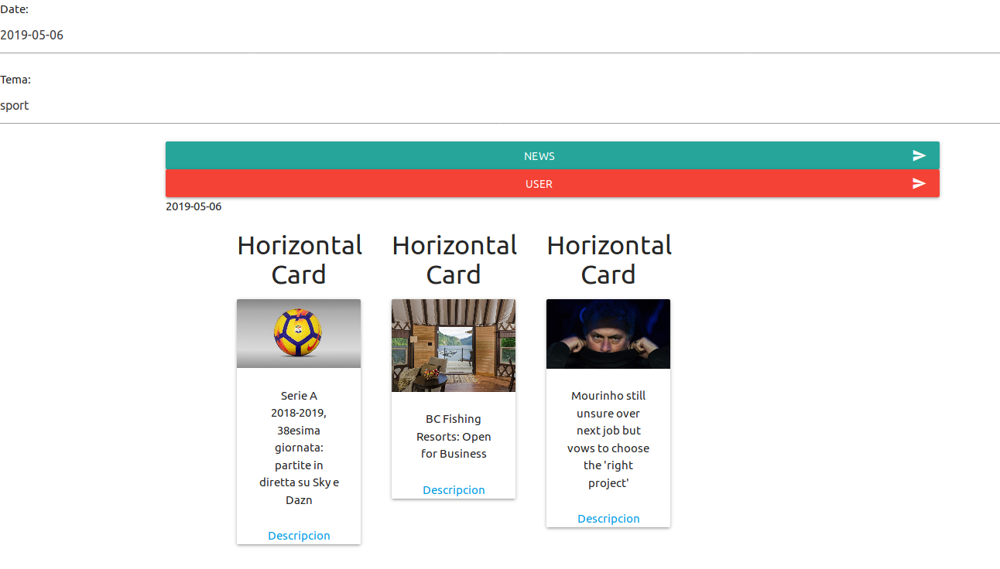
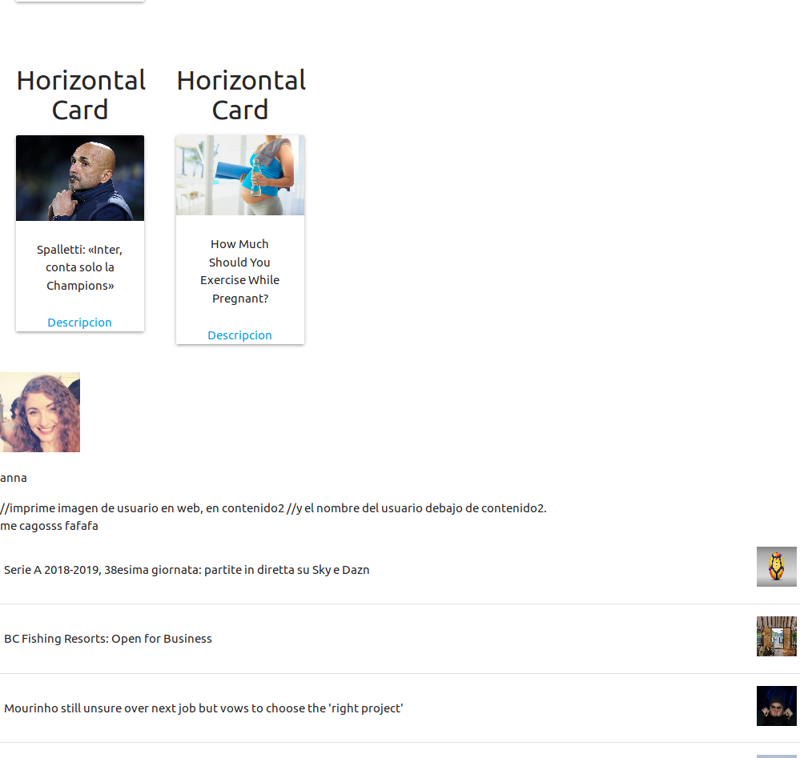

# APIs-publicas-javascript  

Fetch API -  newsapi y  randomuser -APIs en javascript

Utilizo 2 APIs publicas que son: newsapi (noticias)  y randomuser (usuarios aleatorios). 
Hay un ejemplo de como conseguir parametros URL con javascript.
Hay que cambiar "mi_api"  con la api que nos suministre : https://newsapi.org

How to Get URL Parameters with Javascript.
https://usefulangle.com/post/78/javascript-get-url-parameters

